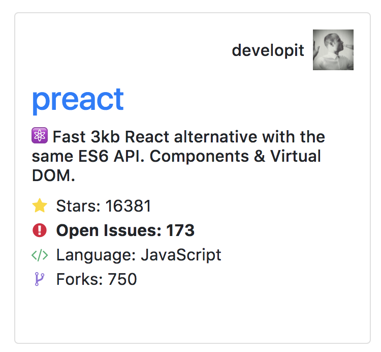

# Challenge #3: Adding & Styling Icons

### 1. Inspect a card. You'll notice that within the `stats` list there are `<i>` tags in the markup.
### 2. Add [this font-awesome stylesheet](https://maxcdn.bootstrapcdn.com/font-awesome/4.7.0/css/font-awesome.min.css) to the document. You should be able to the see the icons now.
### 3. Style the icons so that they look like this mockup

### 4. **Bonus:** Add extra CSS rules/selectors to apply a hover effect (bold text) to each icon
